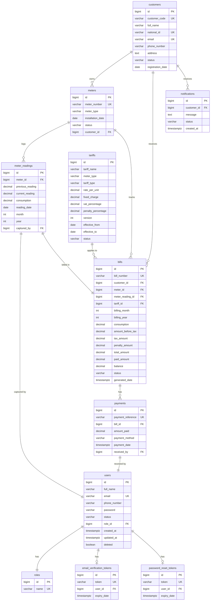
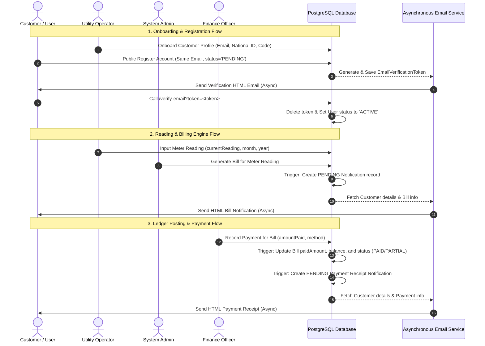

# Utility Billing System — Enterprise Spring Boot Backend

A complete production-ready Spring Boot backend system for postpaid utility billing management (water & electricity). Features dynamic JWT authentication, customer profiles, meter installations, automated meter reading validations, tariff configuration versioning, automated billing engine, payment ledger tracking, and automated system alerts/notifications.

---

## 🛠️ Technology Stack

| Layer | Technology |
|---|---|
| **Core Framework** | Spring Boot 3.4.5 |
| **Language Runtime** | Java 21 |
| **Security** | Spring Security + JWT (jjwt 0.12.6) |
| **Database** | PostgreSQL 12+ (tested on v18) |
| **Database Migrations** | Flyway |
| **Persistence (ORM)** | Spring Data JPA + Hibernate |
| **DTO Mappings** | Manual Mapper Pattern (Compile-safe & high performance) |
| **Validation Layer** | Jakarta Bean Validation |
| **API Documentation** | SpringDoc OpenAPI 3 (Swagger UI) |
| **Mailing** | Spring Boot Starter Mail (JavaMailSender) |
| **Developer Tools** | Project Lombok |

---

## 🚀 Getting Started

### Prerequisites
- **Java 21+** installed and set in `PATH`
- **Maven 3.9+** installed and set in `PATH`
- **PostgreSQL** instance running locally on port `5432`

### 1. Database Creation
Create a new PostgreSQL database called `utility`:
```sql
CREATE DATABASE utility;
```

### 2. Local Configuration Override
Credentials and local variables are managed in `src/main/resources/application-local.properties` (which is excluded from Git to prevent exposing credentials):

Create this file if it does not exist, and add:
```properties
# DataSource Settings
spring.datasource.url=jdbc:postgresql://127.0.0.1:5432/utility
spring.datasource.username=postgres
spring.datasource.password=your_db_password

# JWT Signing Secret (Base64 encoded, min 256-bit)
app.jwt.secret=ZXhhbXBsZS1qd3Qtc2VjcmV0LXdyaXR0ZW4td2l0aC1tdWx0aXBsZS1jaGFyYWN0ZXJzLWZvci1oczI1Ng==

# SMTP Mail Settings (Optional)
spring.mail.username=your-email@gmail.com
spring.mail.password=your-app-password
app.mail.from=noreply@yourdomain.com
app.mail.from-name=UtilityBillingSystem
app.mail.base-url=http://localhost:8080

# Flyway Settings for Local Dev
spring.flyway.clean-disabled=false
spring.flyway.clean-on-validation-error=true
```

### 3. Build & Run
Compile the application and download dependencies:
```powershell
mvn clean compile
```

Launch the Spring Boot application using the `local` profile:
```powershell
mvn spring-boot:run "-Dspring-boot.run.profiles=local"
```

The database schemas, triggers, functions, and seed data will migrate automatically on boot.

---

## 🔑 Seeded Test Accounts
All seeded accounts share the default password: **`Secret@123`**

| Role | Username (Email) | Password | Description |
|---|---|---|---|
| **System Admin** | `admin@utility.com` | `Secret@123` | Can create tariffs, delete meters/customers, search records |
| **Utility Operator** | `operator@utility.com` | `Secret@123` | Responsible for creating customers and uploading meter readings |
| **Finance Officer** | `finance@utility.com` | `Secret@123` | Approves bills and logs customer payments |
| **Customer Support User** | `customer@utility.com` | `Secret@123` | Normal customer role accessing their own bills and payments |

---

## 📐 System Flows & Database Model

### 1. Database Entity-Relationship Diagram (ERD)

The relational schema is structured as follows, separating authentication credentials and roles from the physical customer asset register, readings ledger, tariffs, billing schedules, payment history, and system notifications:



---

### 2. Operational System Lifecycle Flows

The sequence diagram below visualizes the three primary system pipelines: Onboarding/Verification, Meter Readings/Billing calculations, and Finance Payment/Ledger settlement.



---

## 📖 API Documentation & Verification

Once the application is running, you can access documentation and verify endpoints using the following resources:

*   **Swagger UI (Interactive API docs)**: [http://localhost:8080/swagger-ui/index.html](http://localhost:8080/swagger-ui/index.html)
*   **OpenAPI 3 JSON Specification**: [http://localhost:8080/v3/api-docs](http://localhost:8080/v3/api-docs)
*   **Postman Collection**: Locate the [UtilityBillingSystem.postman_collection.json](UtilityBillingSystem.postman_collection.json) file at the root of the workspace. Import it into Postman to run pre-configured flows (Login, Create Customer, Log Reading, Generate Bill, Post Payment, and view Notifications).

---

## 🏗️ Core Architecture & Logic

### 1. Database-Level Automated Triggers
To enforce high integrity and speed up billing operations, the PostgreSQL database contains triggers defined in Flyway migration `V2__triggers_and_routines.sql`:
*   **Bill Alert trigger** (`bill_created_trigger`): Whenever a new bill is inserted, a pending notification is automatically inserted into `notifications` for the customer.
*   **Payment & Bill Sync trigger** (`payment_received_trigger`): Whenever a payment is registered, the target bill's `paid_amount` is incremented and its `balance` is updated. If the balance falls to `0`, the bill status is marked as `PAID` (or `PARTIAL` if partially paid). A transaction notification receipt is also logged automatically.

### 2. Billing Engine
Bills are calculated inside `BillingServiceImpl` according to the following formulas:
$$\text{Consumption Cost} = \text{Consumption (Units)} \times \text{Tariff Rate}$$
$$\text{Subtotal} = \text{Consumption Cost} + \text{Fixed Charge}$$
$$\text{Tax Amount} = \text{Subtotal} \times \text{VAT Percentage}$$
$$\text{Penalty Amount} = \text{Subtotal} \times \text{Penalty Percentage} \text{ (If Overdue)}$$
$$\text{Total Bill Amount} = \text{Subtotal} + \text{Tax Amount} + \text{Penalty Amount}$$

### 3. Email Verification & Password Reset Lifecycle
*   **Account Registration**: Newly registered users are assigned a status of `PENDING` and are blocked from logging in (returning a `403 Forbidden` response). An activation link is sent to the registered email address containing a registration token (valid for 24 hours).
*   **Verification**: Invoking `GET /api/v1/auth/verify-email?token=<token>` activates the user status to `ACTIVE`. A helper endpoint `POST /api/v1/auth/resend-verification?email=<email>` exists to request a new token if needed.
*   **Password Reset**: Requesting a reset via `POST /api/v1/auth/forgot-password` (with body `{"email": "..."}`) sends a reset link to the email. The password can then be reset via `POST /api/v1/auth/reset-password` (with body `{"token": "...", "password": "..."}`) containing the 15-minute token.

### 4. Asynchronous HTML Email System
*   Emails are compiled using Thymeleaf HTML templates: `verification.html` (for registrations), `password-reset.html` (for password resets), and `notification.html` (for bill and payment transactions).
*   All email operations run asynchronously under a configured executor pool (`async-email-` thread prefix) to prevent blocking the REST API request threads.

### 5. Strict Payload Validations
*   **National ID**: Validated using `^\d{16}$` to ensure it is exactly 16 digits.
*   **Phone Numbers**: Validated using `^\+?[0-9]{10,15}$` (optional `+` followed by 10 to 15 digits).
*   **Meter Numbers**: Validated using `^[A-Z0-9\-]{5,20}$` (alphanumeric with optional hyphens, 5-20 characters long).
*   **Reading Dates & Months**: Months must be integers between 1 and 12, years must be after 2000, and current reading values must be positive.

---

## 📂 Directory Layout

```
src/main/java/com/utility/billing/
├── audit/                  # AuditAware context for BaseEntity tracing
├── common/                 # Pagination, Specs, validation constraints, and envelopes
├── config/                 # Security configs, Thread pools (Async), and OpenAPI/Swagger Config
├── controller/             # REST Endpoints (Auth, Customer, Meter, Bill, Payment, Notification)
├── dto/                    # Request bodies and API response models
├── entity/                 # Hibernate models (User, Role, Customer, Meter, Bill, Payment, etc.)
├── enums/                  # System-wide Enums (BillStatus, MeterType, CustomerStatus, etc.)
├── exception/              # ControllerAdvice translating logic faults into JSON responses
├── mapper/                 # Compile-safe DTO/Entity mappings
├── repository/             # JPA/Hibernate query interfaces
├── security/               # JWT validation filters and token issuance engines
└── service/                # Core business layer implementation
```

---

## 📜 License
This project is licensed under the MIT License - see the LICENSE file for details.
